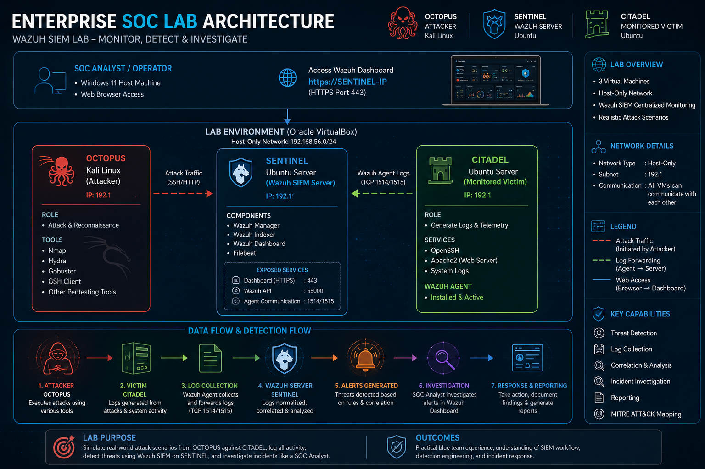

# 01 — Lab Architecture

## 1. Overview

This project implements an enterprise-style Security Operations Center (SOC) lab using Oracle VirtualBox and Wazuh.

The lab consists of three virtual machines:

- **OCTOPUS** — Kali Linux attacker
- **CITADEL** — Ubuntu monitored endpoint
- **SENTINEL** — Ubuntu Wazuh server

A Windows 11 host machine is used to run the VirtualBox environment and access the Wazuh Dashboard through a web browser.

The Windows host machine is not configured as a Wazuh Agent.

---

## 2. Lab Architecture

The following architecture illustrates the complete SOC lab environment, including the attacker machine, monitored endpoint, Wazuh server, dashboard access, network environment, and security monitoring components.

  

---

## 3. OCTOPUS — Attacker

**Operating System:** Kali Linux

OCTOPUS is the attacker and security-testing machine used to generate controlled reconnaissance and attack activity against the monitored endpoint.

### Tools Used

- Nmap
- Nikto
- Gobuster
- Hydra
- cURL

### Activities

- Network reconnaissance
- Service enumeration
- Web reconnaissance
- Directory enumeration
- SSH authentication testing
- HTTP request generation

OCTOPUS represents the offensive security component of the lab and is used to generate activity that can be observed and analyzed through the monitoring infrastructure.

---

## 4. CITADEL — Monitored Endpoint

**Operating System:** Ubuntu

CITADEL is the monitored endpoint in the SOC environment.

The Wazuh Agent is installed on CITADEL and is responsible for collecting relevant endpoint and application telemetry.

### Services and Components

- Wazuh Agent
- Apache HTTP Server
- OpenSSH
- System logging

### Telemetry Sources

- SSH authentication logs
- Apache access logs
- Apache error logs
- System logs
- Security events

The collected telemetry is forwarded from CITADEL to the Wazuh Manager running on SENTINEL for centralized processing and monitoring.

---

## 5. SENTINEL — Wazuh Server

**Operating System:** Ubuntu

SENTINEL is the centralized security monitoring server for the lab.

It provides the core Wazuh infrastructure used to process, analyze, and monitor security events received from CITADEL.

### Components

- Wazuh Manager
- Wazuh Indexer
- Wazuh Dashboard
- Filebeat

### Functions

- Security-event processing
- Alert generation
- Event correlation
- Centralized security monitoring
- Alert investigation
- MITRE ATT&CK visibility

SENTINEL acts as the central point for security-event analysis and monitoring within the lab.

---

## 6. Windows 11 Host Machine

The Windows 11 system is the physical host machine used to run the VirtualBox environment.

It is also used to access the Wazuh Dashboard through a web browser.

### Purpose

- Run the VirtualBox environment
- Access the Wazuh Dashboard
- Review security alerts
- Investigate security events
- Analyze MITRE ATT&CK information

The Windows 11 host is not configured as a Wazuh Agent and is not part of the monitored endpoint infrastructure.

---

## 7. Network Environment

The lab uses a VirtualBox network environment that allows communication between the attacker, monitored endpoint, and Wazuh server.

The primary communication paths within the lab are:

- OCTOPUS communicates with CITADEL during reconnaissance and attack simulations.
- CITADEL forwards security telemetry through the Wazuh Agent to SENTINEL.
- The Windows 11 host accesses the Wazuh Dashboard through a web browser.

IP addresses can change depending on the current VirtualBox network configuration. Therefore, the architecture documentation focuses on the functional roles of the systems rather than relying on static IP addresses.

---

## 8. Security Monitoring Components

| Component | System | Purpose |
|---|---|---|
| Wazuh Agent | CITADEL | Collects endpoint security telemetry |
| Apache HTTP Server | CITADEL | Generates web-server telemetry |
| OpenSSH | CITADEL | Provides SSH authentication activity |
| System Logs | CITADEL | Provides endpoint security events |
| Wazuh Manager | SENTINEL | Processes security events and generates alerts |
| Wazuh Indexer | SENTINEL | Stores and indexes security events |
| Wazuh Dashboard | SENTINEL | Provides centralized monitoring and investigation |
| Filebeat | SENTINEL | Handles event forwarding within the Wazuh stack |
| Web Browser | Windows 11 Host | Provides access to the Wazuh Dashboard |

---

## 9. Lab Roles

| System | Operating System | Role |
|---|---|---|
| **OCTOPUS** | Kali Linux | Attacker / Security Testing |
| **CITADEL** | Ubuntu | Monitored Endpoint |
| **SENTINEL** | Ubuntu | Wazuh Manager / SIEM Server |
| **Windows 11 Host** | Windows 11 | VirtualBox Host / Dashboard Access |

---

## 10. Monitoring Objectives

The architecture is designed to provide visibility into security activity occurring within the monitored environment.

The primary monitoring objectives include:

- Network reconnaissance monitoring
- Service enumeration monitoring
- SSH authentication monitoring
- Apache web-server monitoring
- Web enumeration monitoring
- Endpoint security-event collection
- Wazuh alert generation
- Security-event investigation
- MITRE ATT&CK contextualization

---

## 11. Architecture Evidence

The architecture diagram provides a visual representation of the lab environment and its major components.

**Screenshot:**

`01-enterprise-soc-lab-architecture.png`

---

## 12. Architecture Outcome

The completed lab architecture provides a controlled environment for security testing and defensive monitoring.

OCTOPUS generates controlled security activity, CITADEL provides endpoint and application telemetry, and SENTINEL provides centralized Wazuh monitoring and analysis.

The Windows 11 host provides browser-based access to the Wazuh Dashboard without functioning as a monitored Wazuh Agent.

This architecture forms the foundation for the subsequent detection, investigation, and MITRE ATT&CK analysis documented in the project.
